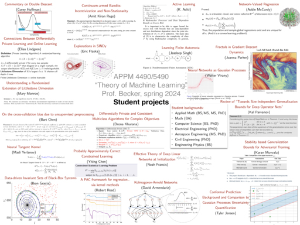
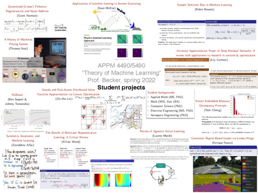
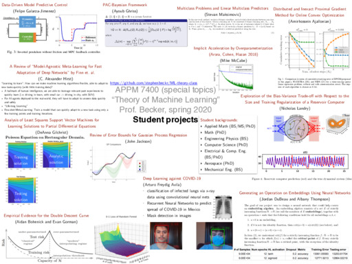

# ML-theory-class
Theoretical Machine Learning (APPM 4490/5490) class, Spring 2024, at CU Boulder

This github repo has a mix of new (Spring 2024) and old material (from when I previously taught it Spring 2020 under the special topics number APPM 7400, and from Spring 2022)

[Syllabus](syllabus.md)

The **old** syllabus for Spring 2020 is [APPM7400_Spr20_TheoreticalML_syllabus.pdf](APPM7400_Spr20_TheoreticalML_syllabus.pdf).  This is *not* for Spring 2022.

What we cover:
- A [day-by-day lecture schedule from Spring 2024](Lectures.md)
- A [day-by-day lecture schedule from Spring 2022](Lectures2022.md)
- A [day-by-day lecture schedule from Spring 2020](Lectures2020.md), *not* for spring 2022.

## Previous versions of the course
- This is taught Spring 2024 as APPM 4490/5490 (instructor: Stephen Becker, Applied Math dept)
- This is taught Spring 2022 as APPM 4490/5490 (instructor: Stephen Becker, Applied Math dept)
- In Spring 2021, this course is [CSCI 7000, APPM 5590, APPM 4490](https://www.bowaggoner.com/courses/2021/learning-theory/) taught by Bo Waggoner, CS dept
- This was taught as a special topics course in Spring 2020 (instructor: Stephen Becker, Applied Math dept)

# Student projects

Spring 2024:

Spring 2022:

Spring 2020:

